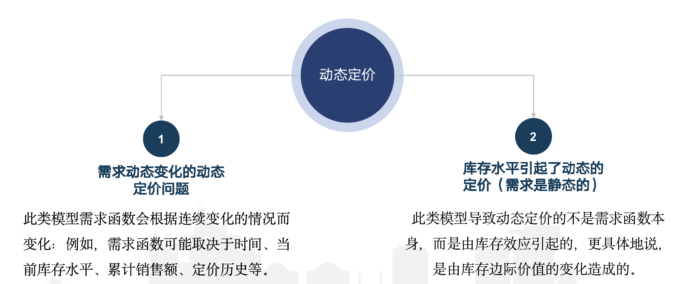
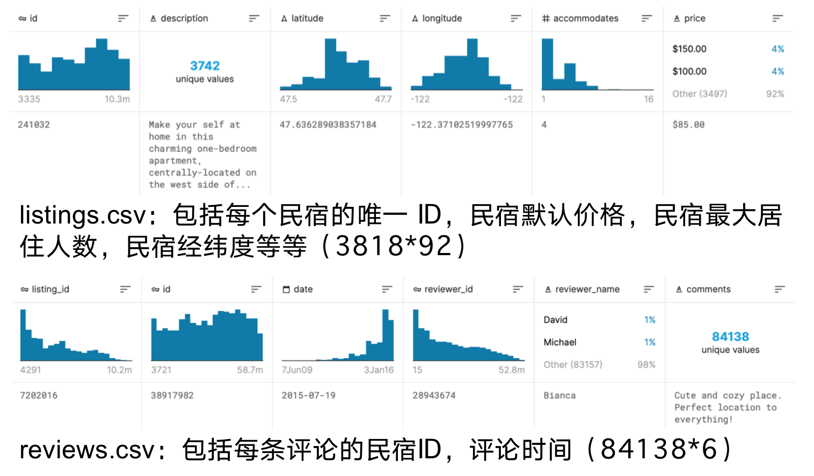
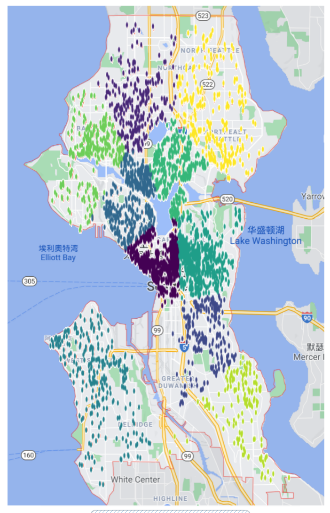
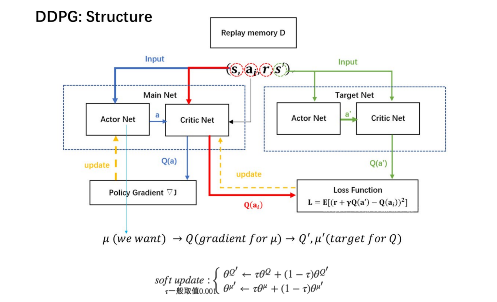
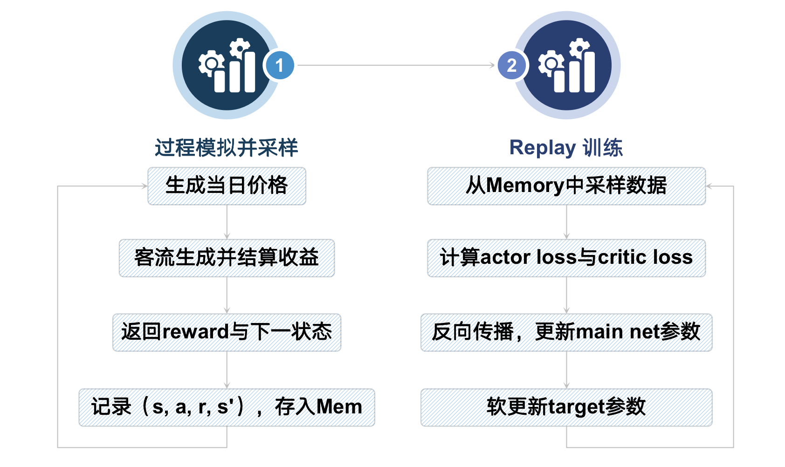

# Goals

## Business Goals
For our project we determined three overarching business goals that we would focus on, which we will then expand upon in the analytics goals and general model. Firstly, our central business goal and the overarching goal of the project is to **maximize yearly profit** (via optimization) for a specific listing on Airbnb. All other goals are aimed either at modifying this central goal or constraining it to make our final solution more viable.
Our second business goal is to **create a dynamic pricing tool** that determines a daily price competitive with other localized Airbnb listings. By determining price at the scale of the smallest possible rental period (daily) we wanted to create a model that was as flexible as possible. This means that our optimization model could be specified down to the specific days that a user would/would not expect to be renting their listing, hopefully further increasing the validity of our end result.
Our third main business goal is to **create an easily repeatable design process** for expansion to other locations. Because our current model has a narrow scope in terms of location, we wanted to be certain that as we constructed our model, our design and the choices we made could be easily replicated in the future so that this model could be adapted to have a more universal utility.

# Dynamic Pricing of Airbnb based on Reinforcement Learning

### Division of Workload

| Student No. | Name   | Responsibility                                               |
| ----------- | ------ | ------------------------------------------------------------ |
| SA20168202  | 甄茂禅 | Investigation, Topic Selection, Making Slides                |
| SA20011082  | 尹智卓 | Problem Definition, DL model Selection, Coding, Debugging, Making Slides |
| SA20168200  | 赵鲜鲜 | Investigation, Topic Selection, Writing Survey               |

### Problem Introduction

 Dynamic Prizing can be divided into the dynamic demanding caused dynamic prizing and the dynamic storage caused dynamic prizing. In the specific scenario of airbnb, it is the first genre of dynamic prizing.

### Data Description and Preprocessing

#### Data Description

We analyze the public datasets on [Kaggle](https://www.kaggle.com/airbnb/seattle) of airbnb in Seattle. 

And we use the prize of homestay, accommodation, location and history comments.

#### Data Preprocessing

We segment the whole dataset into ten areas and assume the inner-region competition is significantly larger than the inter-region competition for simplifying.

### Model Architecture

#### Environment Simulation

We simulate the guests' behavior by exploiting the distribution of the given dataset.

#### Model Selection

After considering the availability of needed data, the application scenario, and the parameter space, we chose the DDPG model as follows with its workflow:

### Analysis and Conclusion

The final result is that compared to the original setting of prices, our reinforcement learning based dynamic pricing policy can achieve around 4.53% of improvements.

However, there is much space for improvements.

- More complex reinforcement learning model.
- The Information sparsity problem.
- More realistic segmentation methods, such as dividing areas based on sightseeing or community blocks.
- More effective reward function.

